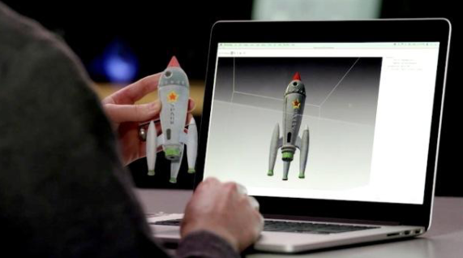
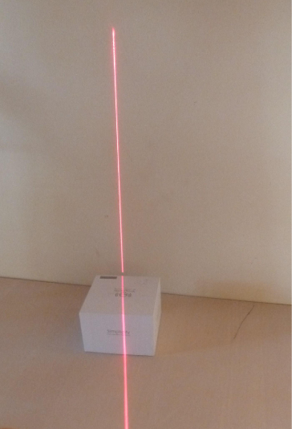
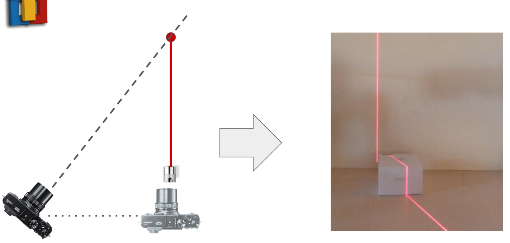
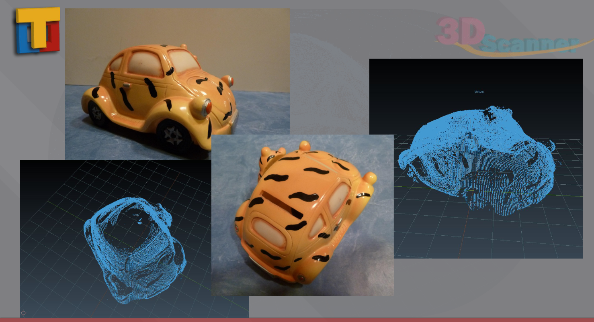
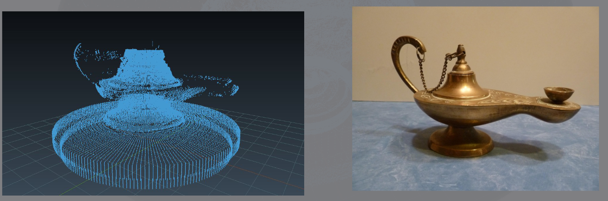
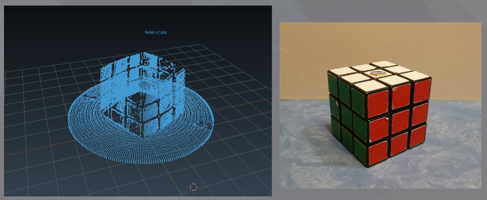
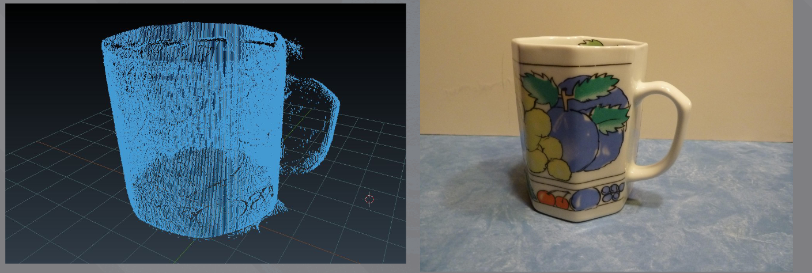
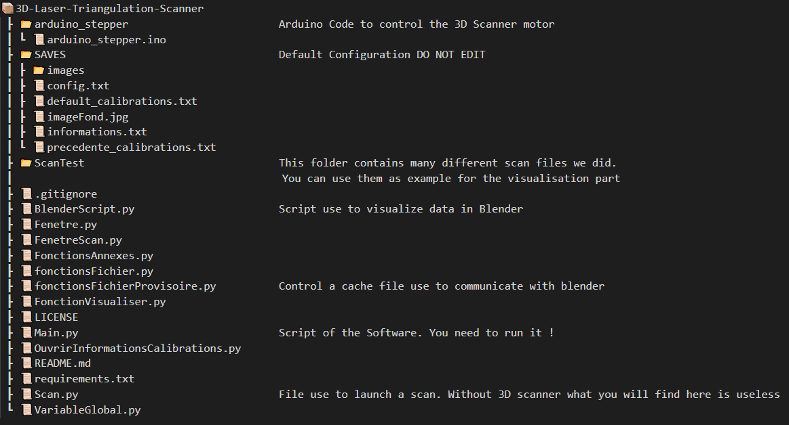

# 3D-Scanner-Using-Laser-Triangulation

This 3D Scanner by Laser Triangulation was built by TAJAN Baptiste, CHAUCHAT Eymeric and CAPGRAS Paul.

It was part of a school project.

Only this readme, will be in English.


# Project Description

The idea was to scan a physical object to get a virtual object and visualise it with Blender.


Laser Triangulation is the name of the technology we used. The idea is very simple, we project a laser band on an object and we observe how this laser band is deformed by the object.



If we observe right behing the laser we can't see anything. But if we move our point of view (= camera / webcam) than we are abble to whatch this deformation



All we have to do is:
- record the image with a camera
- detect and filter the 2D image to get the laser point positions (in the 2D image)
- deduce the 3D positions of the points from the 2D point positions
- rotate the object to mesure all the slices of the object
- determine the displacement created by the rotation
- project and visualize the results with blender

The software presented here is to do and control all that. Without the scanner you can't create new scans but you can easily build your own.


# Visualisation of the Results






Note:
- On some pictures you can see the bracket. At the end we implement a functionality to remove it by doing a capture before putting the object.
- As you can see we get a mesh of points wich it is not stritly speaking a virtual object. Yet you get a good idea about it.

# Setup

### 1. To run the code
- Install python
- Install all the modules in requirements.txt:
````
pip install --no-cache-dir --upgrade -r requirements.txt
````
- Run Main.py
- If you have some package not found or missing please install them and let us know so we can update the requirements.txt file.

### To visualize Scan Examples
- Install Blender
- Run Main.py, in the 
- Configure your path to blender in the bottom right windows called "Lien vers blender".
- Open a scan result (Fichier -> Ouvrir... -> .ScanTest/lampeHuile.txt)
- Visualize the result (Visualisation -> Visualiser)


# Code Architecture


